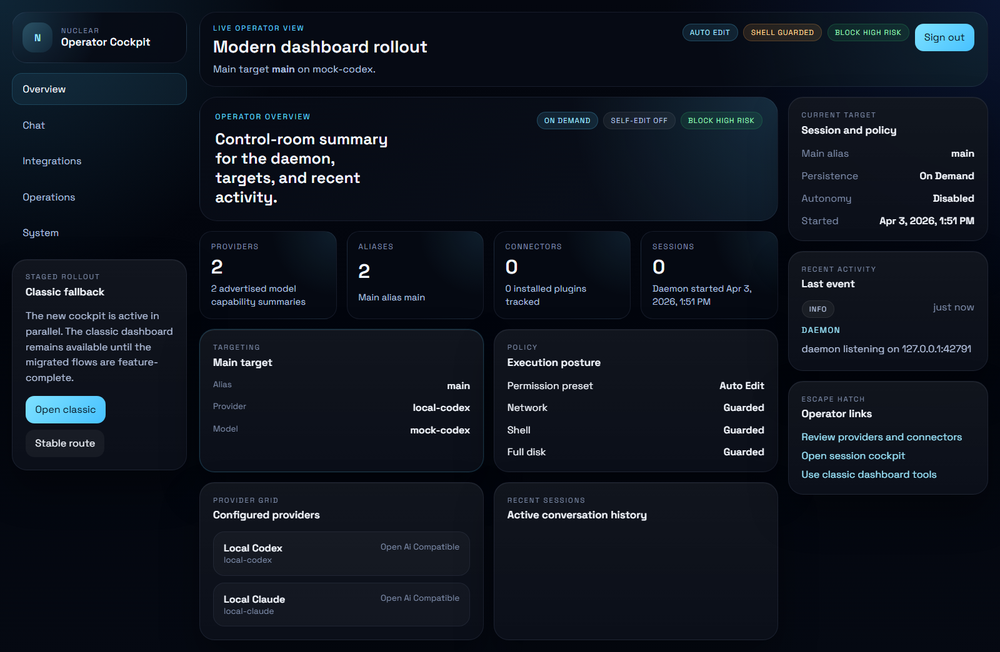

# Nuclear Agent

Nuclear Agent is a local-first agent runtime for Windows and Linux that gives you a real operator surface for serious AI work: a persistent daemon, a terminal-first CLI/TUI, and a browser dashboard that can route models, run guarded tools, manage sessions, and keep state on your machine.

It is built for people who want more than a disposable chat box. You can run it as a coding assistant, a local operator console, a multi-provider model router, or a foundation for plugins, MCP integrations, missions, and higher-trust automation.

## Why It's Useful

- **One runtime, three ways to drive it.** Work from the CLI, stay inside the TUI, or move into the browser dashboard without changing the underlying runtime.
- **Local control instead of mystery SaaS glue.** Providers, aliases, sessions, memory, missions, logs, and plugin state all live in a coherent local system you can inspect and operate.
- **Built for real operator work.** Trust gates, permission presets, remote-content protections, rollback, support bundles, and daemon health surfaces are part of the product instead of afterthoughts.
- **Provider-flexible by design.** Point `main` at a hosted provider, a local endpoint, or a self-hosted OpenAI-compatible service and switch without rebuilding your workflow.
- **Extensible without turning into a mess.** Plugins, MCP-style tools, connectors, and provider adapters plug into the runtime instead of living as unrelated scripts.

## Install In 60 Seconds

### Managed install

Windows:

```powershell
powershell -ExecutionPolicy Bypass -File .\install.ps1
```

Linux:

```bash
./install
```

Managed installs put `nuclear` on your PATH, keep rollback metadata, and migrate legacy managed state one-way into the canonical Nuclear paths.

### Install from source

```bash
cargo build --workspace
cargo install --path crates/agent-cli --force
```

Source installs are the right path if you want to build, debug, or extend the runtime directly from the repo.

## First Run

Complete onboarding:

```bash
nuclear setup
```

Start chatting:

```bash
nuclear
```

Open the browser cockpit:

```bash
nuclear dashboard
```

If you install from source without putting `nuclear` on your PATH, run the equivalent binary directly from your build output.



## What You Can Do With It

### Run agent workflows from the surface that fits the task

Use the CLI for fast prompts and reviews, the TUI for terminal-native sessions, and the dashboard for live operator views, system status, integrations, and session control.

### Route work across multiple model providers

Configure hosted or local providers, map aliases like `main` to the model you actually want, and change routing without rebuilding the rest of your workflow.

### Use tools without giving up control

Tool execution runs through explicit policy and permission gates. Shell, network, filesystem, plugin, and remote-content flows are meant to be inspectable and governable, not magical.

### Keep long-running state local and usable

Sessions, memory, missions, logs, plugin state, and daemon config persist locally so you can resume, compact, inspect, branch, and recover real work instead of starting from scratch every time.

### Extend the runtime instead of bolting things on

Plugins, MCP-style tool surfaces, connectors, provider adapters, and mission workflows all plug into the same runtime model, which keeps extension behavior closer to the core product instead of scattered around wrapper scripts.

### Operate it like software, not a toy

Nuclear Agent includes daemon health checks, doctor commands, rollback companions for managed installs, support-bundle export, deterministic harness coverage, and packaging/release tooling for repeatable builds.

## How It Works

Nuclear Agent centers around a local daemon. The daemon owns runtime state, provider access, policy enforcement, tool execution, sessions, memory, missions, plugin projection, and the dashboard APIs.

The `nuclear` CLI, terminal UI, and browser dashboard are just different operator surfaces over that runtime. You can move between them without changing the underlying agent state.

Provider aliases sit between your workflows and the actual model endpoint, so you can keep using `main` while changing the target provider or model behind it. Policies and permission presets sit alongside that flow so risky actions stay explicit.

## Docs Map

- [Operations](docs/operations.md): health checks, recovery, rollback, support bundles, and auth repair
- [Plugins](docs/plugins.md): plugin packaging, trust model, hosted tool protocol, and connector/provider adapters
- [Reliability](docs/reliability.md): soak flow, fast checks, and stability expectations
- [Harness](docs/harness.md): deterministic and reference evaluation lanes, fixtures, and release-gate behavior
- [Release Checklist](docs/release-checklist.md): packaging, signing, release records, and prerelease validation flow
- [Package README](PACKAGE_README.md): what ships in the managed bundle and how package installs behave

Nuclear Agent is actively hardened and already useful as a local runtime, but some live integrations still need manual validation in real environments, especially provider auth, connector-specific behavior, signing, and soak certification.

## For Contributors

The repo is organized around a few clear subsystems:

- `crates/agent-daemon`: runtime, control plane, dashboard serving, tools, and operator APIs
- `crates/agent-cli`: CLI, TUI, onboarding, and terminal UX
- `crates/agent-providers`: provider adapters, auth helpers, model listing, and provider-facing tool wiring
- `crates/agent-storage`: persistence, migration, logs, sessions, missions, memory, and install-state metadata
- `crates/agent-core` and `crates/agent-policy`: shared contracts, request types, policy, trust, and permissions
- `scripts`, `harness`, and `tests`: verification, packaging, release automation, evaluation fixtures, and end-to-end coverage

If you are making changes, start with the subsystem that owns the behavior, then use the verification scripts and dashboard E2E coverage to prove you did not break the runtime.
